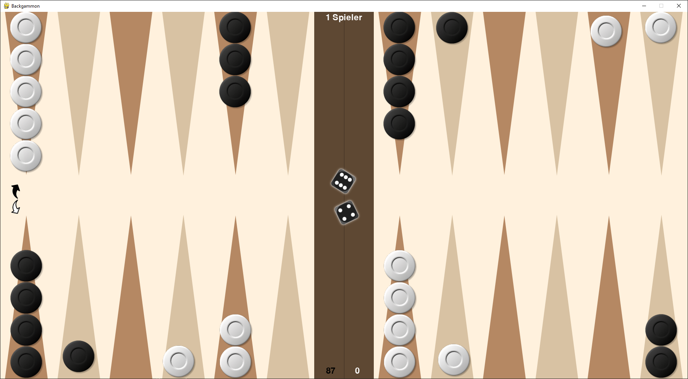

# Backgammon with pygame

Backgammon with free moving pieces to be played with another player via Internet.

## Setup

* Download Python 3.8+ from <https://www.python.org/downloads/>.
* Run `pip install -r requirements.txt` to install dependencies.
* Run `python main.py --server` to host a server with your own client.
* Run `python main.py --host {ip}` to connect to a host as a client.
* The default port is `61096` TCP, which can be changed by passing `--port {port}`.

## Game

* Pres ESC to start a new game.
* The server is black, the client white.
* Press on the diece or press SPACE to roll the diece.
* Move the pieces via mouse.
