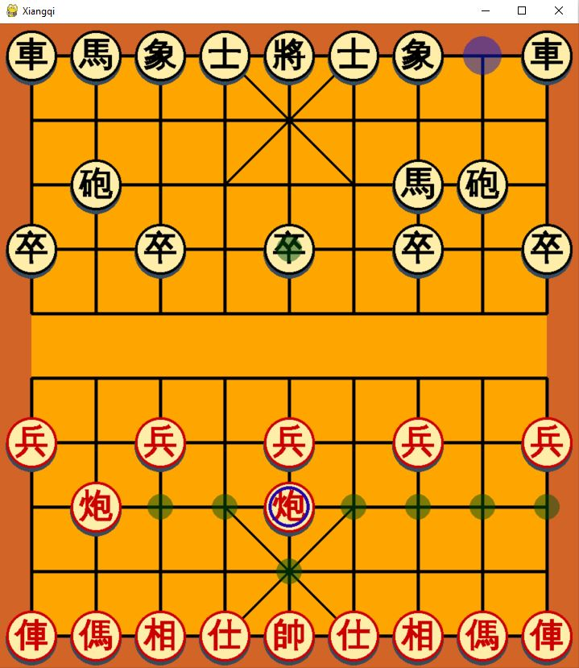

# Xiangqi-ChineseChess

## pygame-chess
Chinese chess game ([Xiangqi](https://en.wikipedia.org/wiki/Xiangqi)) written in python using [pygame](http://www.pygame.org).

### Built-in GUI
Requirement: pygame
```bash
python main.py
```
**Game play**


